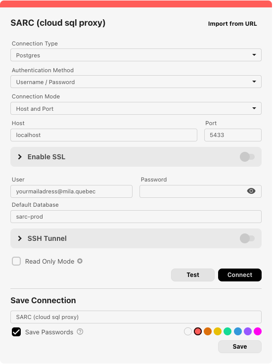

# Connect to PostgresQL

SARC currently uses a PostgresQL database. It can be hosted anywhere, and currently it is hosted on GCP.

If you want to query the SARC data, you can either use the REST API with your username / password or request a read-only access directly to the database for larger and/or custom queries. The read-only access will use your GCP credential and the [Cloud SQL Auth Proxy](https://docs.cloud.google.com/sql/docs/postgres/connect-instance-auth-proxy#install-proxy).

It means that if you want direct DB access you need to have GCP credentials.

# Testing or prototyping

If you just want to test or prototype something based on the SARC database, you can run postgresql on your machine and setup the db structure there. You will then have full read-write access and can do what you want.

See [DB initialisation](cli_db.md) for reference.

# Read access to SQL with a SQL client (like BeeKeeper studio for example)

You can use a local SQL GUI to read SQL data; first, launch `cloud-sql-proxy`

```
./cloud-sql-proxy <SQL_connection_name> -i -p 5433
```

(The default port is `5432` but we use `5433` to not interfere with a local PostgreSQL instance)
note: you can find your value for `SQL_connection_name` in the GCP dashboard, in the section `Cloud SQL`>`Overview`

Then, you can use any SQL frontend; here is the BeeKeeper settings dialog working with the above `cloud-sql-proxy` command line:


