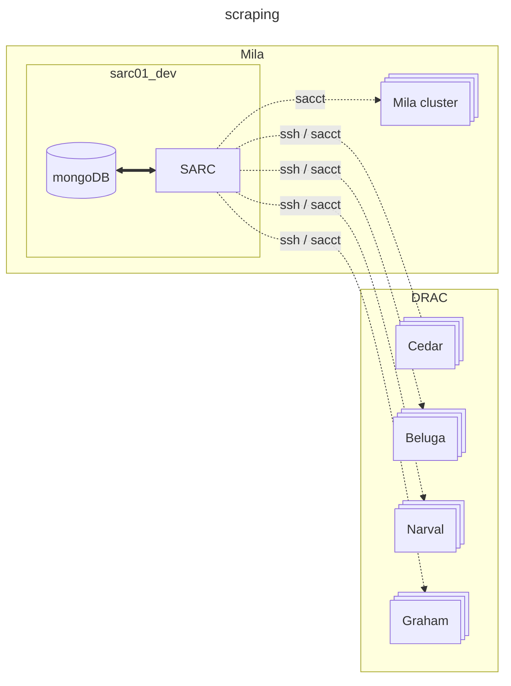

```mermaid
---
title: scraping
---
flowchart LR
	subgraph Mila
		%% direction BT
		subgraph sarc01_dev
		 	%% direction LR
			mongodb[(mongoDB)]
			sarc["SARC"]
		end
		cluster_mila@{shape: procs, label: "Mila cluster"}
	end

	subgraph DRAC
		cluster_cedar@{shape: procs, label: "Cedar"}
		cluster_beluga@{shape: procs, label: "Beluga"}
		cluster_narval@{shape: procs, label: "Narval"}
		cluster_graham@{shape: procs, label: "Graham"}
	end

	mongodb <==> sarc  
    sarc-.sacct.->cluster_mila

    sarc-.ssh / sacct.-cluster_cedar
    sarc-.ssh / sacct.->cluster_beluga
    sarc-.ssh / sacct.->cluster_narval
    sarc-.ssh / sacct.->cluster_graham


	%% Mila ~~~ DRAC
```
