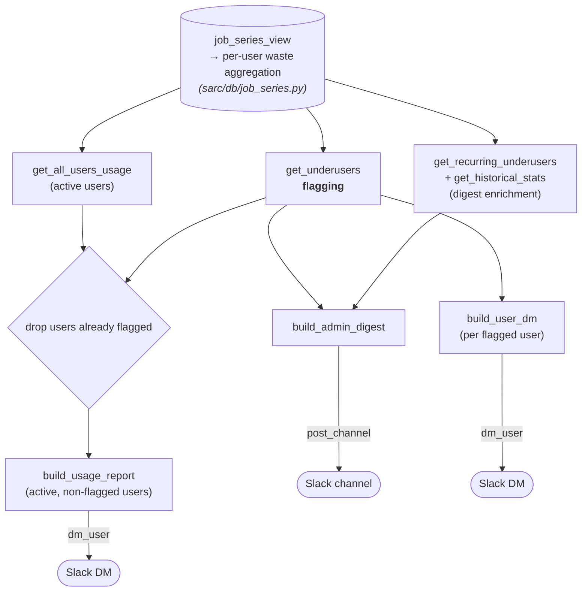
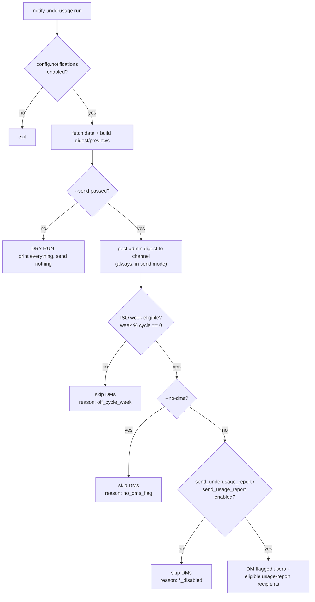

# Underusage Notifications — Architecture

This document describes how SARC flags GPU-underusing researchers and turns that
into reports and notifications. It is a dev-facing overview meant to be read in
~5 minutes; for the exact RGU/waste math, read the well-commented source in
`sarc/notifications/underusage.py`.

## Overview

The system runs periodically (typically weekly, driven by an external scheduler)
via the CLI command `notify underusage`. On each run it looks back over a
rolling window, decides which researchers are wasting GPU allocation, and —
depending on the calendar cadence and config gates — posts a digest for admins
and DMs individual researchers.

A few things to keep straight before the details:

- **The CLI file is only the orchestrator.** `sarc/cli/notify/underusage.py`
  handles dry-run vs. send, calendar eligibility, delivery loops, and summary
  footers. The actual **flagging logic lives in
  `sarc/notifications/underusage.py`**.
- **"Notifications" are delivered on Slack.** A user's `email` is used as the
  key to look them up in Slack. Delivery is Slack DMs plus one channel post.
- **Dry-run is the default.** Nothing is sent unless `--send` is passed *and*
  the relevant config gate is enabled *and* the ISO week is eligible.

## Components at a glance

| Layer | File | Key entry points |
|---|---|---|
| Flagging / data | `sarc/notifications/underusage.py` | `get_underusers`, `get_recurring_underusers`, `get_historical_stats`, `get_all_users_usage` |
| Message building | `sarc/notifications/messages.py` | `build_admin_digest`, `build_user_dm`, `build_usage_report`, `build_recurring_table` |
| Delivery | `sarc/notifications/slack.py` | `SlackClient.dm_user`, `SlackClient.post_channel` |
| Orchestration | `sarc/cli/notify/underusage.py` | `UnderusageNotifyCommand` |

Message bodies come from `str.format` templates in `config/notifications/*.md`,
loaded into config as strings (see `UnderusageNotifyConfig` in
`sarc/config.py`).

## Pipeline flow

The data source (`job_series_view`, defined in `sarc/db/job_series.py`) exposes
one row per job. The pipeline reads only the following columns from it — the raw
inputs to the RGU/waste math, the columns used to filter the window, and the
identity/display fields:

| Column | What it is |
|---|---|
| `allocated_gpu_cost` | Allocated GPU cost in RGU-seconds (`elapsed × gpus × drac_rgu`); `/3600` gives allocated RGU-hours. |
| `allocated_gpu_waste` | Unused portion of that cost in RGU-seconds (`(1 − gpu_sm_occupancy) × allocated_gpu_cost`); the basis for "wasted". NULL/NaN when no `gpu_sm_occupancy` stat was recorded for the job — such jobs are excluded entirely (not counted as fully utilized). |
| `end_time` | Job end time; the analysis window filters on `start ≤ end_time < end`. |
| `allocated_gpu_type` | Allocated GPU type; rows with no GPU type are excluded (non-GPU jobs). |
| `allocated_rgu_drac` | Per-job allocated RGU count; must be non-null for a job to count (guards missing RGU weights). |
| `cluster_name` | Cluster the job ran on; used for the cluster allowlist and per-cluster breakdowns. |
| `sarc_user_id` | User the usage is aggregated by. |
| `email` | Used as the Slack lookup key when DMing the user. |
| `display_name` | Shown in digests, DMs, and reports. |
| `job_db_id` | Job identifier shown in the per-user "top jobs" lists. |
| `submit_time` | Job submit date shown next to each top job. |

Everything downstream consumes aggregates built from these columns. The exact
filters and RGU/waste expressions live in `_with_rgu_window` and `_rgu_exprs`
(`sarc/notifications/underusage.py`).

## What makes a user "flagged"

`get_underusers` aggregates each user's GPU usage across the configured clusters
over the window and computes:

- `wasted` — RGU-hours allocated but not used;
- `waste_ratio` — `wasted / rgu_hours` (equivalently `1 − avg_utilization`).

A user is **flagged when both conditions hold**:

> `waste_ratio ≥ min_waste_ratio` **and** `wasted ≥ min_waste_rgu_hours`

The ratio catches proportionally-wasteful users; the RGU-hours floor ensures the
absolute amount wasted is significant enough to be worth a nudge. Both
thresholds come from config and can be overridden per-run with `--min-ratio` /
`--min-rgu-hours`.

For the admin digest, flagged users are enriched with two extra views:
`get_recurring_underusers` (per-cluster top wasters seen across several recent
cycles, with a "personalized action" flag for persistent offenders) and
`get_historical_stats` (a fleet-wide monthly waste trend with a year-over-year
comparison).

## Cadence and send gating

Each run computes the ISO week number and derives what is *eligible* this week,
then applies the send gates. Underusage alerts recur every
`usage_cycle_length_weeks`; the universal usage report recurs on the wider
`usage_report_cycles × usage_cycle_length_weeks` cadence.

In send mode the admin digest is always posted to the channel; per-user DMs are
the part gated by cadence, the `--no-dms` flag, and the `send_underusage_report`
/ `send_usage_report` config booleans. When DMs are suppressed, each intended
recipient is recorded as `skipped` with the reason shown above (useful for
auditing dry runs).

## The three message types

- **Admin digest** — one `post_channel` message to `slack.channel`. A ranked
  table of flagged users (capped at `digest_top_n`), plus the historical trend
  and the recurring underusers table. Built by `build_admin_digest`.
- **Underusage DM** — sent to each flagged user. Personalized: average
  utilization, RGU-hours wasted, and their lowest-utilization jobs. Built by
  `build_user_dm` from `underusage_report_template.md`.
- **Usage report** — a neutral "here's your usage" DM to active users who were
  *not* flagged. `split_usage_report_recipients` partitions active users so
  flagged users get the alert instead of (not in addition to) the report. Built
  by `build_usage_report` from `usage_report_template.md`.

All DM bodies get a shared footer appended (dashboard link + `help_section.md`).
Templates are plain Python `str.format` strings loaded from
`config/notifications/`.

## Delivery notes

`SlackClient` wraps `slack_sdk.WebClient` with automatic retry on HTTP 429 (rate
limits).

- `dm_user(email, text)` — resolves the user via `users_lookupByEmail`, opens a
  DM conversation, and posts. Returns a `SendStatus` of `OK`, `USER_NOT_FOUND`,
  or `FAILED`.
- `post_channel(channel, text, thread_ts=…)` — posts to the digest channel and
  returns the message timestamp so follow-ups can thread under it.

After sending, the orchestrator posts **delivery-summary footers** (counts of
sent/skipped/failed, plus the emails of any failures) as **threaded replies
under the digest** — giving those numbers a durable home in the channel. If the
digest post itself failed, the summaries fall back to standalone channel
messages.

## Pointers

- **Config:** `UnderusageNotifyConfig` and `SlackConfig` in `sarc/config.py` —
  thresholds, cadence, gates, cluster allowlist, `utilization_ceiling`,
  template/URL references.
- **Templates:** `config/notifications/` — `underusage_report_template.md`,
  `usage_report_template.md`, `help_section.md`.
- **Tests:** `tests/unittests/notifications/` — data layer, message builders,
  Slack transport, CLI dry-run, config validation.
