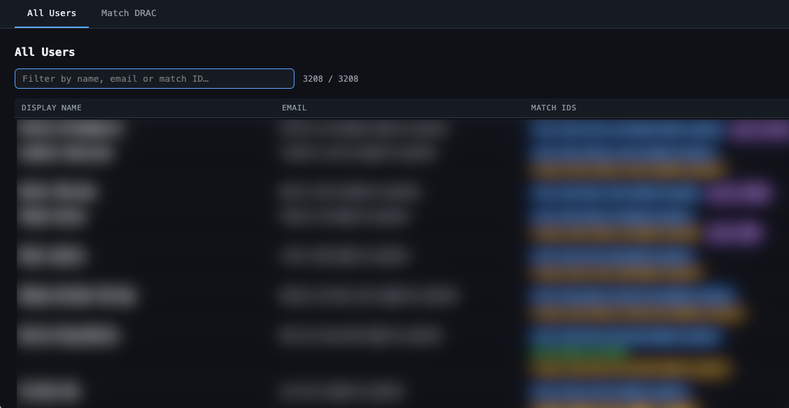
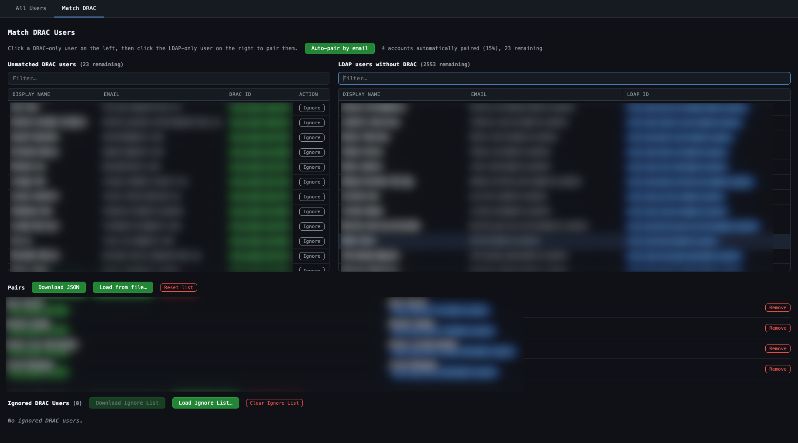
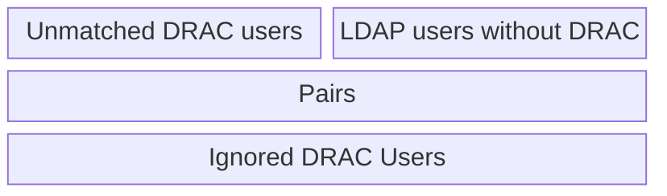

> [!NOTE]
> Prerequisites:
>
> - [new DRAC users imported into the database](drac_user_import.md)
> - [functional SQL connection to the DB (read-only)](db_connection.md)

# manual user matching file principle

This task is a manual task, ideally done after every new DRAC user import.

- The process aims to produce a JSON file, continaing association between DRAC acounts and Mila accounts.
- Once generated, the file is given to SARC and will be processed during the next user parsing (usually, users are processed hourly).
- Once processed by SARC, the pairings in the file are useless. Thus, a new file can be generated each time the manual pairing process is done, even if the user has the possibility to reload the previous file in the pairing interface.

# usermatch interface

First we need a config file to connect to local sql proxy.

This is an example `cloudsql_db.yaml` config file:

```
sarc:
  db:
    host: 127.0.0.1
    port: 5433
    user: yoursername@mila.quebec
    name: sarc-prod
  patches: patches
```

You can now launch the user mathcin interface:

```
%SARC_CONFIG=cloudsql_db.yaml uv run python scripts/usermatch/main.py

Loading users from database…
Loaded 3210 users.
Serving at http://127.0.0.1:64761/  (Ctrl-C to stop)
```

After some time (approx. one minute) a web browser will be launched to the address output, in our case `http://127.0.0.1:64761/`

## "All Users" page



This page lists all users in SARC db. No particular action is possible in this page, it is only there for search purpose.

The columns are:

- `DISPLAY NAME`
- `EMAIL` the main email address
- `MATCH IDS` the different ids for this user, from the different sources (with color code) : `mila_ldap`/`mymila`/`legacy_dump`/`drac_member`

## "Match DRAC" page



In this one, there are 4 lists.



### Creating matches

> [!Tip]
> The `Auto-pair by email` button will automatically match entries with the same @mila.quebec e-mail address.
> This is a good practice to start with it.

One the left, the `Unmatched DRAC Users` list, with all users with a `drac_member` ID, but with no LDAP account. These are the items we want to match.
On the right, the `LDAP users without DRAC` list, which are available for matching with DRAC entries.

Select one item on each list, and a new entry will be added to the `Pairs` list in the bottom, removing these two entries from the top lists.

### matching file

Even if it's not mandatory, you can read a previous version of the matching file with the `Load from file...` button.
You can save the file with the `Download JSON` button.

### ignore list file

Some rare cases are unsolvable; some DRAC accounts cannot be merged to any existing LDAP account in SARC, for whatever reason (account too old to have been catched by SARC scrapings, for example)

To reduce the overhead, you can add a DRAC account to the ignore list with the `Ignore` button of the entry in the `Unmatched DRAC users` list.

Like the `Pairs` list, you can load/save the ignore list.

> [!Note]
> The ignore list file is not injected into SARC, it is up to you to keep a copy of it between user matching runs.

> [!Tip]
> Some DRAC profiles may be present in the SARC database, with no LDAP corresponding entry. Usually it is due to an old DRAC user import, with already expired accounts, not present anymore in the LDAP before SARC even started gathering it.
> You can determine if this is an obsolete account by searching in the [Mila directory](https://mila.quebec/en/directory), and if it is an "alumni" account, then you can put them in the "ignore list" without guilt.

# Apply matching file to SARC

At this point you get a `usermatch.json` file.

This file must replace previous `sarc-config/patches/id_matches/mapping.json` file, from the **private** repository [sarc-config](https://github.com/mila-iqia/sarc-config/tree/main/patches/id_matches).

Once put in SARC config, matching pairs will be processed durin gthe next `sarc parse users` run (typically, les than one hour later), the users will be merged in SARC db and the jobs will be linked to the merged user.

Just one more commit and you're done with this account matching session.
