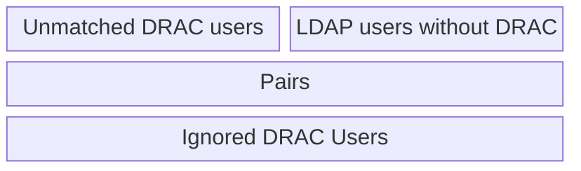

> [!NOTE]
> Prerequisites:
>
> - [new DRAC users imported into the database](drac_user_import.md)
> - [functional SQL connection to the DB (read-only)](db_connection.md)

# manual user matching file principle

This task is a manual task, ideally done after every new DRAC user import.

- The process aims to produce a JSON file, continaing association between DRAC acounts and Mila accounts.
- Once generated, the file is given to SARC and will be processed during the next user parsing (usually, users are processed hourly).
- Once processed by SARC, the pairings in the file are useless. Thus, a new file can be generated each time the manual pairing process is done, even if the user has the possibility to reload the previous file in the pairing interface.

# usermatch interface

temp: SARC_CONFIG=config/cloud/cloudsql_db.yaml uv run python scripts/usermatch/main.py

2 onglets: "all users" et "match drac"

## "All Users" page

This page lists all users in SARC db. No particular action is possible in this page, it is only there for search purpose.

The columns are:

- `DISPLAY NAME`
- `EMAIL` the main email address
- `MATCH IDS` the different ids for this user, from the different sources (with color code) : `mila_ldap`/`mymila`/`legacy_dump`/`drac_member`

## "Match DRAC" page

In this one, there are 4 lists.

### Creating matches

> [!Note]
> The `Auto-pair by email` button will automatically match entries with the same @mila.quebec e-mail address.
> This is a good practice to start with it.

One the left, the `Unmatched DRAC Users` list, with all users with a `drac_member` ID, but with no LDAP account. These are the items we want to match.
On the right, the `LDAP users without DRAC` list, which are available for matching with DRAC entries.

Select one item on each list, and a new entry will be added to the `Pairs` list in the bottom, removing these two entries from the top lists.

### matching file

Even if it's not mandatory, you can read a previous version of the matching file with the `Load from file...` button.
You can save the file with the `Download JSON` button.

### ignore list file

Some rare cases are unsolvable; some DRAC accounts cannot be merged to any existing LDAP account in SARC, for whatever reason (account too old to have been catched by SARC scrapings, for example)

To reduce the overhead, you can add a DRAC account to the ignore list with the `Ignore` button of the entry in the `Unmatched DRAC users` list.

Like the `Pairs` list, you can load/save the ignore list.

> [!Note]
> The ignore list file is not injected into SARC, it is up to you to keep a copy of it between user matching runs.

# Apply matching file to SARC

[TODO]
